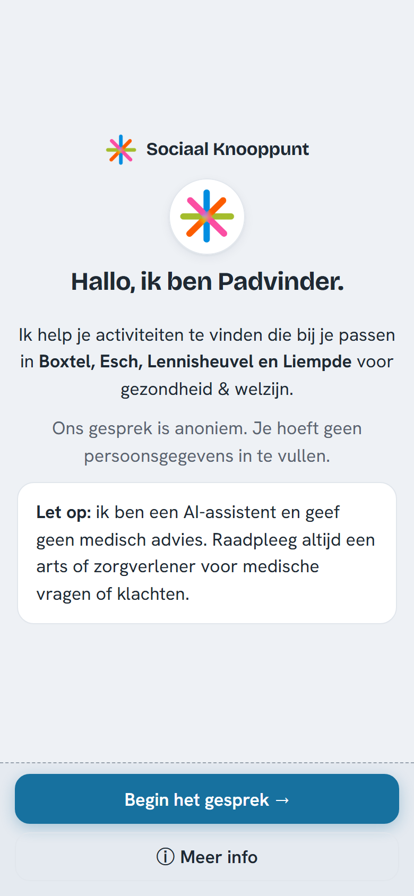
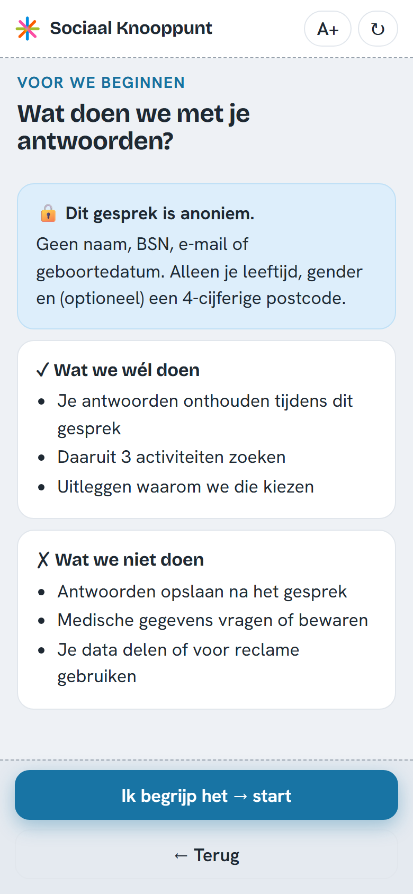

# AI Chatbot Frontend: Padvinder

Frontend van de **Padvinder**-chatbot voor het *Sociaal Knooppunt* (gemeente
Boxtel, Esch, Lennisheuvel en Liempde), gebouwd als schoolproject
(Fontys IT-groepsproject) voor opdrachtgever Carla Renders / Renders Education.

Padvinder is een React + Vite single-page applicatie die de bezoeker via een
vriendelijke **wizard** door de zes pijlers van het **Leefstijlroer** leidt en op
basis daarvan passende activiteiten en voorzieningen in de buurt voorstelt.

> ### 📦 Overdracht
>
> Dit prototype (proof of concept) is gebouwd om **overgedragen** te worden aan
> een volgende projectgroep die het verder optimaliseert en opschaalt. Deze
> README is daarom bewust uitgebreid: ze legt niet alleen vast *wat* er staat,
> maar ook *waarom* het zo gebouwd is, hoe je het draait, en welke punten nog
> openstaan. Begin bij **[Aan de slag](#aan-de-slag)** en lees daarna
> **[Architectuur](#architectuur-as-built)** en **[Voor de volgende
> groep](#voor-de-volgende-groep)**.

> Dit deel van het project, het **ontwerp en de bouw van de frontend**, is mijn
> (Sahel Nawabi) bijdrage aan het groepsproject. De code is overgenomen uit de
> [gedeelde groepsrepo](https://github.com/Tutai-Tran/Fontys-AI-chatbot) en hier
> als zelfstandige frontend-repo samengebracht. De onderbouwing staat in de
> analyse- en adviesdocumenten. Zie [Onderbouwende
> documenten](#onderbouwende-documenten).

---

## Inhoud

- [Videodemo](#videodemo-volledige-ux-tour)
- [Schermen (mobiel)](#schermen-mobiel)
- [Functionaliteit](#functionaliteit)
- [Technische stack](#technische-stack)
- [Aan de slag](#aan-de-slag)
- [Architectuur (as-built)](#architectuur-as-built)
- [De gespreks-flow en de drie routes](#de-gespreks-flow-en-de-drie-routes)
- [Backend-koppeling & datacontract](#backend-koppeling--datacontract)
- [Ontwerpkeuzes en onderbouwing](#ontwerpkeuzes-en-onderbouwing)
- [Toegankelijkheid](#toegankelijkheid)
- [Privacy by design](#privacy-by-design)
- [Verschillen tussen advies en bouw](#verschillen-tussen-advies-en-bouw)
- [Voor de volgende groep](#voor-de-volgende-groep)
- [Onderbouwende documenten](#onderbouwende-documenten)
- [Licentie](#licentie)

---

## Videodemo: volledige UX-tour

Een doorlopende opname van de complete frontend: alle drie de startroutes en
álle schermen, opgenomen met de volledige stack lokaal actief (frontend +
FastAPI/ChromaDB/Ollama-backend), zodat ook de echte resultaten kloppen.

https://github.com/user-attachments/assets/edc9d355-71a5-4fd3-aaea-6c16697df386

> Speelt de speler hierboven niet af? Bekijk de video dan via de
> [release](https://github.com/sahelboy/AI-Chatbot-Frontend/releases/download/v1.0-demo/padvinder-ux-tour.mp4)
> of open [`docs/padvinder-ux-tour.mp4`](docs/padvinder-ux-tour.mp4) in de repo.

**Hoofdstukken (±1:40):**

| Tijd | Wat je ziet |
|------|-------------|
| 0:00 | Welkom, privacy & startkeuze → route **"Nee, ik weet het nog niet"** (volledige leefstijlscan): sliders, middelen, samenvatting, onderwerp, profiel, resultaten, activiteit kiezen, contact, account aanmaken, afsluiting |
| 0:28 | **Lage scores**: vervolgvragen, een vraag overslaan, en het huisarts-advies (lage-score-scherm) |
| 0:50 | Route **"Ja, ik weet precies wat ik wil"**: directe vraag → resultaten |
| 1:00 | **Crisisdetectie** en doorverwijzing (112 / 113 / Veilig Thuis) |
| 1:09 | Route **"Ik heb een idee"**: onderwerpen kiezen → vervolgvragen → resultaten |
| 1:22 | **Geen match** → inlooplocatie → contact |

## Schermen (mobiel)

De videodemo hierboven toont de volledige desktop-flow. Hieronder de **mobiele
weergave**: onder 600px breedte schakelt de app automatisch naar een aparte
mobiele interface met volledige-breedte knoppen.

| Welkom (mobiel) | Privacy (mobiel) |
|:---:|:---:|
|  |  |

## Functionaliteit

- **Wizard-flow** door de zes leefstijlpijlers: Bewegen, Voeding, Ontspanning,
  Verbinding, Slaap en Middelen.
- **Drie startroutes** ("precies / een beetje / nog niet"): zelf een vraag
  stellen, één of twee pijlers kiezen, of de volledige leefstijlscan doorlopen.
- **Sliders (0–100) en vervolgvragen** per pijler; vervolgvragen verschijnen
  automatisch bij een lage score (< 40 = *aandachtspunt*).
- **Transparante matching**: onder de drie resultaten toont een
  *match-reasoning*-paneel welke score, voorkeuren en belemmeringen tot de match
  hebben geleid.
- **Crisis-herkenning**: bij signalen van crisis (server-side gedetecteerd) toont
  de app rustige doorverwijzing in plaats van activiteiten.
- **Alternatieve routes**: lage-score-advies (huisarts), geen-match → inloop,
  vraag overslaan.
- **Opt-in account & contact**: gegevens worden pas gevraagd nadat de inwoner er
  zelf voor kiest.
- **Aparte mobiele interface** onder 600px breedte.
- **Toegankelijkheid (a11y)**: ontworpen op WCAG 2.2 AA (kleurcontrast,
  toetsenbordnavigatie, focusbeheer, grote-tekst-modus).
- **Privacy by design**: alle gespreksgegevens blijven in het geheugen. Er wordt
  niets in `localStorage` of `sessionStorage` opgeslagen.

## Technische stack

- **React 19**
- **Vite 8** (dev-server + productie-build)
- **ESLint 10** voor linting
- Geen extra UI-frameworks of state-libraries, alleen eigen componenten, eigen CSS
  (`src/styles/padvinder.css`) en React's ingebouwde `useReducer` + `useEffect`.

---

## Aan de slag

**Vereisten:** **Node.js 20+** (LTS aanbevolen; Vite 8 vereist Node ≥ 20.19) en
**npm**.

```bash
# 1. Dependencies installeren
npm install

# 2. Ontwikkelserver starten  →  http://localhost:5173/demo/
npm run dev

# Productiebuild maken (output: ../app/static/demo, zie hieronder)
npm run build

# Build lokaal bekijken
npm run preview

# Linten
npm run lint
```

> **Let op de `base` en `outDir`.** In `vite.config.js` staat `base: '/demo/'` en
> `build.outDir: '../app/static/demo'`. De app draait dus onder het pad `/demo/`
> en de build schrijft naar de `app/static/demo`-map van de **backend-repo**
> (de groepsrepo), zodat FastAPI de gebouwde frontend als statische bestanden kan
> serveren. Draai je deze repo standalone en wil je de build elders, pas dan deze
> twee waarden aan.

### Met of zonder backend?

- **Zonder backend** werkt de interface (de hele wizard, navigatie, validatie),
  maar bij het zoeken naar activiteiten komt er een netwerkfout en zie je het
  *geen-match*-scherm.
- **Voor de volledige flow** (echte activiteiten + crisisdetectie) draai je de
  backend lokaal op `http://localhost:8000`. De Vite-dev-server proxyt de
  API-aanroepen daarheen. Zie
  [Backend-koppeling](#backend-koppeling--datacontract). Hoe je de backend +
  ChromaDB + Ollama opstart staat in de [groepsrepo](https://github.com/Tutai-Tran/Fontys-AI-chatbot).

---

## Architectuur (as-built)

Padvinder is **geen vrije chat**, maar een **gestuurde wizard**: een lineaire,
script-gebaseerde flow met sliders, keuzeknoppen en enkele open velden. De LLM
zit alleen aan de backend-kant (semantisch zoeken + crisisdetectie); de frontend
bouwt uit de antwoorden één zoekopdracht en toont de teruggegeven activiteiten.

```
src/
├── main.jsx                # Entry point (React StrictMode + global CSS)
├── App.jsx                 # Root: useReducer-state, desktop/mobiel-switch,
│                           #   schermrouter (Screen/WizardScreen) en de
│                           #   matching-call (useEffect bij 'matching'-scherm)
├── state/
│   └── flow.js             # ⭐ Kern: INITIAL-state, reducer en buildSteps()
│                           #   (de step-machine die de wizardvolgorde bepaalt)
├── lib/
│   ├── apiClient.js        # Alle backend-calls + SSE-parser (/chat/stream)
│   ├── buildQuery.js       # Pure helpers: state → scores/filters/B1-bericht
│   │                       #   + buildReasoning() (de match-uitleg)
│   └── useIsMobile.js      # matchMedia-hook voor de 600px-breakpoint
├── data/
│   └── leefstijl.js        # Pijlers, middelen, vragen-config, drempels, kleuren
├── components/             # Herbruikbare UI
│   ├── Slider.jsx          #   toegankelijke 0–100 slider (input[type=range])
│   ├── questions.jsx       #   keuze-/multi-/tekstvraag-componenten
│   ├── results.jsx         #   ResultCard + Reasoning-paneel
│   └── ui.jsx              #   Shell (frame), Avatar, koppen, ChoiceGroup, ...
├── screens/                # Desktopschermen
│   ├── intro.jsx           #   Welkom · Privacy/consent · Startkeuze
│   ├── pillars.jsx         #   Slider · Middelen · Vervolgvragen · Pijlerkeuze · Directe vraag
│   ├── wrapup.jsx          #   Samenvatting · Onderwerp · Profiel
│   ├── outcome.jsx         #   Matching · Resultaten · Account · Contact · Klaar
│   ├── alt.jsx             #   Crisis · Lage score · Geen match · Inloop · Overslaan
│   ├── nav.jsx             #   FooterNav (Vorige/Skip/Volgende) + voortgangsbolletjes
│   └── mobile/             #   Aparte mobiele schermen (zelfde state, eigen layout)
├── assets/                 # Padvinder-logo + Leefstijlroer-pictogrammen
└── styles/
    └── padvinder.css       # Alle styling (design-tokens, responsive, big-text)
```

### Hoe het samenhangt

1. **Eén centrale state.** `App.jsx` houdt de volledige gespreks-state in één
   `useReducer` (`reducer` + `INITIAL` in `state/flow.js`). Alle schermen krijgen
   `state` + `dispatch` als props; er is geen losse component-state voor
   gespreksgegevens. Dit is bewust licht gehouden (geen Redux/Zustand) voor de
   overdraagbaarheid.
2. **De step-machine.** `buildSteps(state)` leidt uit `entryType` en de scores
   de **volgorde van wizardstappen** af. Lage scores voegen automatisch een
   vervolgvraag-stap toe. `NEXT`/`BACK`/`SKIP` bewegen door deze lijst; bij de
   laatste stap schakelt de state naar het `matching`-scherm.
3. **Twee niveaus van routing.** `state.screen` kiest het hoofdscherm
   (`wizard`, `matching`, `results`, `crisis`, …); binnen `wizard` kiest
   `state.stepId` de concrete wizardstap. Zie de `Screen`/`WizardScreen`-switches
   in `App.jsx`.
4. **De matching-call.** Zodra `state.screen === 'matching'` is, draait een
   `useEffect` in `App.jsx` de backend-call: `buildQuery.js` zet de verzamelde
   antwoorden om in een zoekopdracht, `apiClient.streamChat()` POST't naar
   `/chat/stream` en leest de SSE-stream. Komt er een `crisis`-event → crisis-
   scherm; komen er `activities` → resultaten (met `buildReasoning()` als uitleg).
5. **Desktop vs mobiel.** `useIsMobile()` (600px) bepaalt of `App` de
   desktop-`Screen` of de `MobileScreen` rendert; beide lezen exact dezelfde
   state.

## De gespreks-flow en de drie routes

De startkeuze (`entryType`) bepaalt welke route de bezoeker loopt:

| Route | `entryType` | Wat de bezoeker doet |
|-------|-------------|----------------------|
| **"Ja, ik weet precies wat ik wil"** | `precies` | Typt zelf een vraag → profiel → resultaten |
| **"Ik heb een idee"** | `beetje` | Kiest 1–2 pijlers → vervolgvragen → profiel → resultaten |
| **"Nee, ik weet het nog niet"** | `nog_niet` | Volledige leefstijlscan: sliders per pijler (+ vervolgvragen bij lage score) → middelen → samenvatting → onderwerp → profiel → resultaten |

Daarnaast zijn er **alternatieve uitkomsten** (`screens/alt.jsx`):

- **Crisis**: backend stuurt een `crisis`-event; activiteiten worden verborgen.
- **Lage score**: in `nog_niet` met álle scores laag → rustig huisarts-advies.
- **Geen match / fout**: geen activiteiten terug → inloop-/contactsuggestie.
- **Overslaan**: bevestigingstussenscherm wanneer een vraag wordt overgeslagen.

## Backend-koppeling & datacontract

De frontend praat via een dunne REST/JSON-laag (`src/lib/apiClient.js`) met de
**Sociaal Knooppunt**-backend (FastAPI). Tijdens het ontwikkelen proxyt de
Vite-dev-server deze paden door naar `http://localhost:8000`; zie de
`apiPaths`-lijst in `vite.config.js`:

| Endpoint | Gebruikt voor |
|----------|---------------|
| `POST /chat/stream` | Hoofd-call: zoekt activiteiten + crisisdetectie. Antwoord is een **SSE-stream** met events `activities`, `delta`, `crisis`, `done`. |
| `GET /activities`, `GET /activities/{id}` | Activiteiten opvragen/filteren (hulpfuncties). |
| `POST /users` | Account aanmaken (opt-in). Geeft `503` → feature uitgeschakeld. |
| `POST /users/{id}/contact-requests` | Contactverzoek (opt-in). |
| `GET /health` | Health-check (proxy geconfigureerd). |

**Vertaallaag (belangrijk bij wijzigingen).** `apiClient.js` vertaalt tussen de
namen in de frontend-state en de namen in het contract. Houd deze mapping in de
gaten als het backend-contract verandert:

- scores: `{ bewegen: 35, … }` → `[{ pillar: 'bewegen', score: 35 }, …]`
  (conform **ADR-001**: 0 = ongelukkig, 100 = gelukkig).
- filters: `{ groep, binnenBuiten, … }` → `{ individueel_groep, binnen_buiten, … }`.
- berichten: `{ role:'bot'|'user', text }` → `{ role:'assistant'|'user', content }`.

De anonieme sessie-id wordt **in-memory** aangemaakt (`crypto.randomUUID`) en als
`X-Session-Id`-header meegestuurd; hij wordt nergens opgeslagen.

> **Match-reasoning wordt nu client-side gebouwd.** `buildReasoning()` in
> `buildQuery.js` stelt de "Waarom past dit bij jou?"-uitleg samen uit de
> *frontend*-state (gekozen voorkeuren, laagste score, wijken in het resultaat).
> Het advies was om de backend hier een gestructureerd `reasoning`-veld voor te
> laten leveren (mini-ADR); dat staat nog open. Zie
> [Voor de volgende groep](#voor-de-volgende-groep).

---

## Ontwerpkeuzes en onderbouwing

De onderstaande keuzes komen uit het analyse- en adviestraject (DOT Framework van
HBO-i). Per keuze kort het *wat* en *waarom*; de volledige onderbouwing met
bronnen staat in de [documenten](#onderbouwende-documenten).

| # | Keuze | Waarom (kort) |
|---|-------|---------------|
| 1 | **React + Vite** | Prototype dat lokaal en zelfstandig draait; snelle HMR, lichte build, breed bekend → goed overdraagbaar; geen licentiekosten. Een zwaardere stack (bv. Next.js/SSR) voegt niets toe voor dit lokale PoC. |
| 2 | **Kleine, vaste set herbruikbare componenten** (slider, keuzevraag, tekstvraag, samenvattingskaart, activiteitenkaart, reasoning-paneel, crisismelding) | De flow herhaalt steeds dezelfde paar interactievormen. Elk patroon één keer goed bouwen = minder code, minder a11y-bugs, en sneller te begrijpen voor de volgende groep. |
| 3 | **Lichte state met `useReducer` + props** (geen Redux/Zustand) | Eén gesprek per sessie en een lineaire flow hebben geen externe state-library nodig. Eén centrale reducer houdt de state leesbaar en overdraagbaar (DoD-eis). |
| 4 | **Toegankelijkheid als** *definition of done* | De doelgroep (15–99 jaar, laaggeletterden, ouderen, mensen met beperkingen) maakt WCAG 2.2 AA een vereiste, geen extra. Zie [Toegankelijkheid](#toegankelijkheid). |
| 5 | **B1-taalniveau in álle microcopy** | Niet alleen chatberichten, maar ook knoplabels, foutmeldingen en placeholders op B1, met dezelfde verboden-/voorkeurswoorden als de bot (system-prompt V2.1). Eén consistente toon voorkomt dat de doelgroep afhaakt. |
| 6 | **Sliders 0–100 conform ADR-001** | `<input type="range">` als basis → pijltjestoetsen en schermlezers werken vanzelf. 0 = ongelukkig, 100 = gelukkig; score < 40 = *aandachtspunt* → triggert een vervolgvraag. |
| 7 | **Klein, strikt datacontract** | Houdt de frontend losgekoppeld van het taalmodel en laat beide teams parallel werken. De UI toont uitsluitend velden die echt in `activities.json` bestaan, geen verzonnen details. |
| 8 | **Privacy zichtbaar in de UI** | Anoniem gesprek (alleen in-memory UUID), geen tracking, minimale gegevens (geen BSN/geboortedatum), zichtbare reset-knop. Zie [Privacy](#privacy-by-design). |
| 9 | **Transparantie van matching** | Een reasoning-paneel onder de drie activiteiten laat zien *waarom* iets wordt voorgesteld, een eis van Carla en van de AVG-checklist (§7). Voorkomt dat een aanbeveling voelt als "de computer beslist". |
| 10 | **Dedicated crisis-component** | Bij een server-side crisis-signaal een rustige doorverwijzing (113 / huisarts / Veilig Thuis) en géén activiteiten. De frontend genereert zelf geen crisis-tekst. |

## Toegankelijkheid

De interface is ontworpen voor een brede doelgroep op B1-taalniveau en richt zich
op **WCAG 2.2 AA**. Concreet in de code:

- **Toetsenbord & focus.** De volledige flow is met het toetsenbord te bedienen.
  Bij elke schermwissel verplaatst `Shell` (in `components/ui.jsx`) de focus naar
  de kop, zodat schermlezers het nieuwe scherm aankondigen. De crisis-/dialoog-
  schermen beheren focus en `Escape`.
- **Sliders.** Gebouwd op de native `<input type="range">` met `aria-valuetext`,
  dus pijltjestoetsen en schermlezers werken zonder extra werk (`components/Slider.jsx`).
- **Grote-tekst-modus.** Een `A+`-knop in de balk schakelt `big-text` in
  (`state.bigText`), die via CSS de hele interface vergroot.
- **Kleurcontrast & klikvlakken.** Design-tokens en knopformaten in
  `styles/padvinder.css` zijn op AA-contrast en ruime tap-targets afgestemd.
- **Status-feedback.** De typing/laad-indicator gebruikt `role="status"` zodat de
  wachttijd op het LLM wordt aangekondigd.

## Privacy by design

- **Geen opslag.** Alle gespreks-state leeft in het React-geheugen (`useReducer`).
  Er wordt **niets** in `localStorage`/`sessionStorage` gezet.
- **Anonieme sessie.** Enige identifier is een in-memory UUID (`apiClient.js`),
  meegestuurd als `X-Session-Id`. Verdwijnt bij refresh.
- **Dataminimalisatie.** Geen BSN, geen geboortedatum, alleen leeftijd en een
  4-cijferige postcode (frontend-validatie vóór verzending). Account en contact
  zijn **opt-in** en standaard uit.
- **Reset-knop.** Een zichtbare reset wist de volledige sessie-state (`RESET`).

---

## Verschillen tussen advies en bouw

Eerlijk voor de overdracht: het gebouwde prototype wijkt op enkele punten af van
het analyse-/adviesdocument. Dat is normaal: de analyse is vooraf geschreven en
de bouw bracht voortschrijdend inzicht. De belangrijkste afwijkingen:

| Onderwerp | Advies/analyse | Wat er gebouwd is | Reden |
|-----------|----------------|-------------------|-------|
| **Interactiemodel** | `<ChatWindow>` / `<MessageList>` met chatbubbels | Gestuurde **wizard** met losse schermen en een step-machine | De flow is in de praktijk lineair en script-gedreven; aparte schermen zijn voor deze doelgroep rustiger en beter te bedienen dan een doorlopende chat. |
| **Endpoint** | `POST /chat` (async), streaming optioneel | `POST /chat/stream` met **SSE** | De backend levert activiteiten + crisis als losse stream-events; de frontend pakt het eerste relevante event en breekt de rest af. |
| **Match-reasoning** | Gestructureerd `reasoning`-veld van de backend | Client-side opgebouwd in `buildReasoning()` | Het backend-`reasoning`-contract was nog niet vastgelegd; de uitleg is voorlopig uit de frontend-state afgeleid. **Nog te verbeteren.** |
| **Geautomatiseerde tests** | Vitest + vitest-axe in CI | Nog **niet** in deze repo aanwezig | Binnen de PoC-scope niet gehaald; staat hoog op de lijst hieronder. |

## Voor de volgende groep

Concrete punten om mee verder te gaan (afgeleid uit de openstaande adviespunten
en de stand van de code):

**Datacontract afronden met het backend-team**
- [ ] Leg de vorm van **`reasoning`** vast (mini-ADR): levert de backend per match
      een gestructureerd `{ pijler, voorkeur, belemmering }`-object? Vervang dan
      `buildReasoning()` door de echte backend-data.
- [ ] Beslis waar matches terugkomen: via `POST /chat/stream` (huidig) of een
      apart `GET /activities`-endpoint.
- [ ] Bepaal of `askedField` (welk invoercomponent na een bot-bericht) wordt
      toegevoegd.
- [ ] Bevestig de definitieve `Activity`-velden en houd de UI daar strikt op
      (geen verzonnen velden).

**Kwaliteit & tests (nu nog niet in de repo)**
- [ ] **Unit tests** (Vitest) op `state/flow.js` (reducer + `buildSteps`) en
      `buildQuery.js`.
- [ ] **a11y-tests** (vitest-axe) op de interactieve componenten; falende test
      blokkeert de merge.
- [ ] Handmatige **toetsenbord- en schermlezertest** (NVDA/VoiceOver) door de
      hele flow.
- [ ] **Lighthouse** op een productiebuild (doel: Accessibility ≥ 95).

**Productie-aandachtspunten (nu buiten scope)**
- [ ] Volledige juridische AVG-uitwerking (DPIA, verwerkersovereenkomsten),
      encryptie at rest, vóór ingebruikname.
- [ ] Meertaligheid, native apps, productie-infrastructuur, bewust buiten dit PoC.

**Waar te beginnen in de code**
- De flow snappen → lees `src/state/flow.js` (de step-machine is het hart).
- Een scherm aanpassen → de schermen in `src/screens/` (en hun mobiele variant in
  `src/screens/mobile/`).
- Het backend-contract → `src/lib/apiClient.js` (de enige plek met `fetch`).
- Teksten/pijlers/drempels → `src/data/leefstijl.js`.

## Onderbouwende documenten

De ontwerp- en bouwkeuzes zijn onderbouwd in vier documenten (DOT Framework,
HBO-i), opgesteld door Sahel Nawabi. De PDF's staan in deze repo onder
[`docs/analyse/`](docs/analyse):

- [**Analysedocument V3 (Frontend)**](docs/analyse/Analyse_Frontend_V3.pdf):
  het onderzoek (Library/Field/Workshop/Lab/Showroom) naar doelgroep,
  Leefstijlroer, WCAG 2.2 AA, B1, conversational UI, componentstructuur,
  state-model en datacontract.
- [**Adviesrapport V3 (Frontend)**](docs/analyse/Advies_Frontend_V3.pdf):
  de concrete aanbevelingen die uit de analyse volgen (de elf kernadviezen,
  risico's en vervolgstappen).
- [**Verantwoording Analyse**](docs/analyse/Verantwoording_Analyse_Frontend.pdf)
  en [**Verantwoording Advies**](docs/analyse/Verantwoording_Advies_Frontend.pdf):
  verantwoording van de gevolgde aanpak en keuzes.

## Licentie

Schoolproject, gemaakt in het kader van een Fontys IT-groepsproject (Sociaal
Knooppunt / Renders Education). Geen commerciële licentie.
